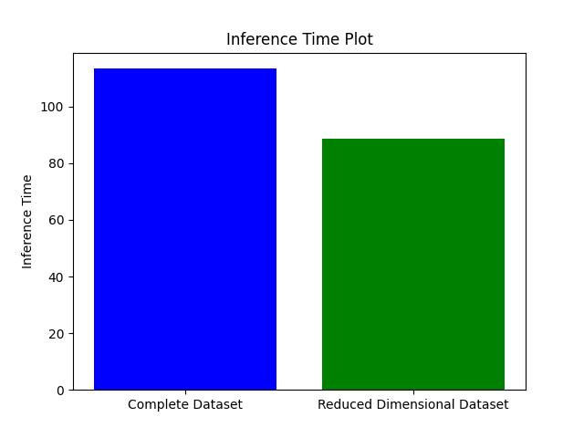

# Assignment 2 Report - Samkit Jain

## 3. K-Means Clustering

### 3.1 Implement K-Means Class:

The class has been implemented in models/k_means/kmeans.py 

### 3.2 Optimal number of clusters

Using the elbow method on the 512-dimensional dataset, its observed that the elbow is at k=5


Therefore, $ k_{means1} = 5 $

The results of the clusters of the 200 datapoints are as such:


## 4. Gaussian Mixture Models

### 4.1 Implement GMM class:

The class has been implemented in models/gmm/gmm.py

### 4.2 Optimal number of clusters

The written class does not work due to various reasons, some of which are:
1. Singular Covariance Matrix:
 - In high-dimensional data, covariance matrices can become nearly singular( i.e., determinant is 0), which makes it difficult to compute the inverse during the multivariate normal PDF calculation.

2. Underflow/Overflow in Log-Likelihood:
 - In high-dimensional spaces, the values computed in the log-likelihood or during the multivariate normal calculation can become extremely small or large, leading to numerical underflow (resulting in NaN) or overflow (resulting in inf).

The inbuilt Sklearn avoids these issues by applying regularization to the covariance matrix or uses a different type of covariance matrix type.

Using AIC and BIC for the 512 dimensional data we get the following plot:


Since, we get the lowest information criterion for k=1, $k_{gmm1}=1$

## 5. Dimensionality Reduction and Visualization

### 5.1 Implement PCA class:

The class has been implemented in models/PCA/pca.py

### 5.2 Dimensionality reduction

PCA was used to reduce the dimensionality to 2 and 3. The checkPCA() function returns true as well to confirm the dimensionality reduction.

The data in 2 dimensions as shown below:


The data in 3 dimensions as shown below:


### 5.3 Data Analysis

The new 2D or 3D dimensions capture the directions in which the data varies the most. The first principal component (PC1) captures the highest variance, and the second (PC2) or third (PC3) captures the next most significant directions of variance.

Similar word embeddings that cluster together (e.g., synonyms or related words) should remain grouped, while words with different meanings or contexts should be more distant in the reduced dimensions. This is the data that the new axes probably hold and represent about the data.

On examining the plots, a rough estimate of about 5 comes to mind since it looks like it could be divided into 5 groups. Therefore, $k_2=5$

## 6. PCA + Clustering

### 6.1 K-means clustering on 2D data

The elbow plot for the 2D dataset after PCA is as shown.


Again, we can observe that the elbow occurs at k=5.

Therefore, $k_2=5$

The output on using KMeans with $k=k_2$ is as follows:


### 6.2 PCA + K-Means Clustering

The scree plot for PCA is shown below:


We observe that the elbow occurs at PC=5 after which the explained variance ratio does not decrease much. 

The elbow plot for 5D data is shown below:


Its clear that the elbow occurs at k=6.

Therefore, $k_{means3}=6$

The clustering output for $k_{means3}$ and PC=5 is shown below:


### 6.3 GMM clustering on 2D data

After running the GMM class on 2D data, the following were the final parameters of the gaussians:


Since all data points have certain membership in c=each cluster, it is difficult to plot the points on the graph.

### 6.4 PCA + GMMs

On using AIC and BIC the following plot was observed:


On observing the AIC plot, the elbow occurs at k=3 and is not very different k=4 as well. On the other hand, the BIC shows the elbow to occur at k=2 or k=3. So, the best estimate for  $k_{gmm3}$ is 3.

GMM was used for clustering of the 5D data, which was the optimal number of dimensions obtained from the scree plot using $k_{gmm3}$

The parameters for the gaussians are as follows:


## 7. Cluster Analysis

### 7.1 K-Means Cluster Analysis

Below are the clustering results of each of the above `kmeans1`,`k2` and `kmeans3`.

```
kmeans1 
0 : drive, deer, rose, helicopter, eraser, carrot, fishing, bear, spider, bullet, shark, grass, giraffe, forest, lizard, brush, feather, spoon, frog, puppet, fly, lake, scream, monkey, plant, knit, cigarette, baseball, puppy, boat, pear, fish, saturn, flute, fruit, scissor, grape, mouse, finger, candle, goldfish, bird, spiderman, tree, beetle, hammer, toothbrush, screwdriver, snake, teaspoon, length, rain, airplane, pizza, swim, dragonfly, butterfly, sword, rainy, knife, toothpaste, bicycle, windmill, arrow, fork, truck, paintbrush

1 : ape, sit, cat, mug, eat, rifle, bed, microwave, dig, run, clap, pull, van, feet, laptop, calendar, oven, calculator, ambulance, television, camera, zip, car, pant, stove, toaster, potato, shoe, radio

2 : panda, gym, cow, pencil, starfish, sweater, microphone, jacket, sun, peacock, badminton, ant, bee, tent, tomato, parachute, lantern, elephant, crocodile

3 : dive, needle, table, exit, brick, postcard, bend, climb, kneel, passport, roof, stairs, catch, notebook, bench, bucket, basket, slide, door, chair, ladder, igloo, clock, pillow, envelope, skate, fingerprints, dustbin, throne, loudspeaker, telephone, basketball, wheel, comb, walk, keyboard, suitcase

4 : sing, listen, flame, knock, smile, bury, download, hard, fight, call, face, kiss, selfie, hit, paint, far, cry, sleep, hollow, clean, sad, empty, drink, draw, pray, arrest, email, buy, burn, fire, close, angry, lazy, scary, hang, book, tattoo, earth, tank, enter, key, happy, loud, love, cook, recycle, cut, sunny

k2 
0 : peacock, crocodile

1 : drive, sing, listen, rose, dive, flame, sit, knock, exit, brick, smile, bullet, bury, download, eat, postcard, hard, bend, fight, puppet, call, fly, face, climb, kneel, scream, kiss, passport, selfie, catch, hit, paint, far, dig, cry, notebook, run, clap, pull, sleep, cigarette, baseball, hollow, puppy, clean, basket, sad, empty, fish, slide, drink, draw, pray, arrest, email, buy, bird, clock, burn, fire, close, angry, lazy, scary, hang, envelope, skate, hammer, book, snake, tattoo, earth, dustbin, rain, tank, pizza, enter, key, swim, zip, happy, loud, love, rainy, cook, basketball, arrow, recycle, cut, shoe, walk, sunny, radio, truck

2 : gym, knit, sweater, jacket, pillow

3 : needle, eraser, carrot, brush, feather, spoon, microwave, saturn, flute, scissor, badminton, finger, igloo, toothbrush, screwdriver, fingerprints, teaspoon, length, sword, loudspeaker, telephone, knife, toothpaste, comb, fork, paintbrush

4 : deer, panda, ape, helicopter, cat, table, fishing, bear, spider, shark, grass, giraffe, forest, lizard, mug, frog, lake, monkey, roof, stairs, rifle, cow, pencil, bed, starfish, plant, van, microphone, bench, sun, bucket, feet, boat, pear, fruit, grape, laptop, door, calendar, chair, mouse, ladder, candle, ant, goldfish, oven, calculator, spiderman, bee, tree, beetle, airplane, ambulance, television, throne, tent, camera, tomato, dragonfly, parachute, butterfly, car, lantern, elephant, pant, stove, wheel, bicycle, windmill, toaster, potato, keyboard, suitcase

kmeans3 
0 : panda, ape, cat, eat, gym, cow, pencil, dig, run, van, sun, peacock, bee, tomato, parachute, lantern, elephant, pant, potato

1 : sit, table, kneel, roof, stairs, bed, bench, feet, fruit, chair, ladder, throne, wheel, shoe

2 : listen, flame, knock, bury, download, postcard, hard, fight, call, selfie, catch, hit, paint, far, cry, clap, sleep, clean, sad, slide, drink, draw, pray, arrest, email, buy, burn, fire, close, angry, lazy, scary, hang, book, enter, happy, loud, love, cook, recycle, cut

3 : smile, mug, face, rifle, microwave, pull, sweater, microphone, jacket, bucket, laptop, calendar, candle, igloo, oven, calculator, pillow, envelope, ambulance, television, tent, camera, car, loudspeaker, stove, toaster, radio, suitcase

4 : deer, helicopter, bear, spider, shark, giraffe, lizard, frog, fly, monkey, starfish, saturn, ant, goldfish, bird, spiderman, beetle, snake, airplane, pizza, dragonfly, butterfly, windmill, crocodile

5 : drive, sing, rose, dive, needle, eraser, carrot, exit, brick, fishing, bullet, grass, forest, brush, feather, spoon, bend, puppet, lake, climb, scream, kiss, passport, plant, notebook, knit, cigarette, baseball, hollow, puppy, boat, pear, basket, empty, fish, flute, scissor, grape, door, badminton, mouse, finger, clock, tree, skate, hammer, toothbrush, screwdriver, tattoo, earth, fingerprints, teaspoon, length, dustbin, rain, tank, key, swim, zip, sword, telephone, rainy, knife, toothpaste, basketball, bicycle, arrow, comb, walk, keyboard, fork, sunny, truck, paintbrush


```

Observations:

1. kmeans1
    - Cluster 0: This seems like a large, somewhat diverse cluster. It contains a variety of nouns (e.g., "drive", "rose", "frog") and verbs (e.g., "scream", "fly"), suggesting that it may be overly inclusive.
    - Cluster 1: Contains more daily activity-related terms like "eat", "clap", "run", and objects like "microwave", "shoe". This seems fairly coherent.
    - Cluster 2 & 3: Similar grouping of nouns and activities, but they don't seem as tightly bound in semantic relation.
    - Cluster 4: Has more abstract and action-oriented terms like "sing", "love", "sleep", etc. A bit mixed.
2. k2
    - Cluster 0: Very small cluster containing just two items, "peacock" and "crocodile". This is likely not ideal, as small clusters typically mean overfitting.
    - Cluster 1: Contains mostly action words like "drive", "eat", "sing", mixed with some objects (e.g., "radio", "arrow"). This seems coherent.
    - Cluster 2 & 3: Has a nice mix of nouns and tools, although a little mixed.
    - Cluster 4: Contains many animals, plants, and natural entities, like "deer", "bear", "giraffe", "tree", and other real-world objects. Seems like a well-formed cluster.
3. kmeans3
    - Cluster 0: This cluster focuses on animals and daily-life objects. It’s coherent in its focus on life-related entities.
    - Cluster 1: Similar to Cluster 0, grouping objects and actions like "bed", "feet", "fruit", "chair". Seems well-formed.
    - Cluster 2: Contains a variety of action-oriented words like "listen", "knock", "cry", and "love". This seems coherent.
    - Cluster 4: Groups various animals and natural objects like "helicopter", "bear", "giraffe", and "crocodile". Logical.
    - Cluster 5: Contains a mix of actions and objects like "drive", "sing", "needle", "carrot", and "passport". This is a large, diverse cluster but mostly coherent.

Taking the above observations in consideration, `kmeans3` looks like the best value of clusters for results.

Therefore, $k_{means}=k_{means3}=6$

### 7.2 GMM Cluster Analysis

Below are the clustering results of each of the above `kgmm1`,`k2` and `kgmm3`.

```
kgmm1 
0 : drive, sing, deer, panda, ape, listen, rose, dive, flame, helicopter, sit, knock, cat, needle, eraser, table, carrot, exit, brick, fishing, smile, bear, spider, bullet, shark, grass, giraffe, bury, download, forest, lizard, brush, mug, feather, eat, postcard, hard, spoon, bend, frog, fight, puppet, call, fly, gym, lake, face, climb, kneel, scream, monkey, kiss, passport, selfie, roof, stairs, rifle, catch, cow, hit, pencil, bed, starfish, paint, plant, far, microwave, dig, cry, notebook, run, clap, pull, sleep, knit, van, sweater, cigarette, microphone, baseball, hollow, jacket, bench, sun, bucket, puppy, clean, feet, boat, pear, basket, sad, empty, peacock, fish, saturn, slide, flute, fruit, drink, scissor, grape, laptop, door, draw, calendar, badminton, chair, mouse, ladder, pray, arrest, finger, email, candle, ant, buy, igloo, goldfish, bird, clock, oven, calculator, spiderman, bee, burn, pillow, fire, close, angry, lazy, scary, tree, hang, beetle, envelope, skate, hammer, toothbrush, book, screwdriver, snake, tattoo, earth, fingerprints, teaspoon, length, dustbin, rain, tank, airplane, ambulance, pizza, enter, television, throne, key, swim, tent, camera, zip, tomato, dragonfly, parachute, butterfly, car, sword, loudspeaker, happy, lantern, telephone, loud, elephant, love, pant, stove, rainy, knife, cook, toothpaste, basketball, wheel, bicycle, windmill, arrow, recycle, toaster, potato, comb, cut, crocodile, shoe, walk, keyboard, fork, sunny, radio, truck, suitcase, paintbrush

k2 
0 : needle, table, climb, roof, stairs, bench, chair, ladder, throne, loudspeaker, lantern, stove, suitcase

1 : deer, panda, ape, helicopter, cat, spider, grass, giraffe, lizard, mug, frog, gym, rifle, cow, bed, starfish, microwave, van, jacket, sun, feet, pear, peacock, saturn, fruit, grape, laptop, calendar, ant, igloo, goldfish, calculator, spiderman, bee, pillow, tree, beetle, ambulance, television, tent, camera, tomato, dragonfly, parachute, butterfly, car, elephant, pant, bicycle, windmill, toaster, potato, crocodile

2 : listen, flame, sit, knock, bury, download, eat, hard, fight, call, fly, catch, hit, far, dig, cry, run, clap, pull, sleep, clean, sad, slide, draw, pray, arrest, email, buy, burn, fire, close, angry, lazy, scary, hang, book, enter, happy, loud, love, recycle, cut

3 : drive, sing, rose, dive, exit, brick, fishing, smile, bear, bullet, shark, forest, postcard, bend, puppet, lake, face, kneel, scream, monkey, kiss, passport, selfie, paint, plant, notebook, baseball, hollow, bucket, puppy, boat, basket, empty, fish, drink, door, mouse, bird, clock, oven, envelope, skate, hammer, snake, tattoo, earth, dustbin, rain, tank, airplane, pizza, key, swim, zip, sword, telephone, rainy, cook, basketball, wheel, arrow, shoe, walk, keyboard, sunny, radio, truck

4 : eraser, carrot, brush, feather, spoon, pencil, knit, sweater, cigarette, microphone, flute, scissor, badminton, finger, candle, toothbrush, screwdriver, fingerprints, teaspoon, length, knife, toothpaste, comb, fork, paintbrush

kgmm3 
0 : panda, needle, eraser, giraffe, brush, feather, spoon, stairs, pencil, starfish, knit, sweater, microphone, jacket, bench, peacock, flute, scissor, badminton, chair, ladder, toothbrush, screwdriver, teaspoon, length, throne, dragonfly, parachute, loudspeaker, lantern, toothpaste, windmill, comb, crocodile, fork, paintbrush

1 : deer, ape, rose, helicopter, cat, table, carrot, brick, fishing, bear, spider, shark, grass, forest, lizard, mug, frog, puppet, gym, lake, climb, monkey, passport, roof, rifle, cow, bed, plant, microwave, notebook, van, cigarette, baseball, sun, bucket, puppy, feet, boat, pear, basket, fish, saturn, fruit, grape, laptop, door, calendar, mouse, finger, candle, ant, igloo, goldfish, bird, clock, oven, calculator, spiderman, bee, pillow, tree, beetle, envelope, skate, hammer, snake, fingerprints, dustbin, rain, airplane, ambulance, pizza, television, tent, camera, tomato, butterfly, car, sword, telephone, elephant, pant, stove, rainy, knife, basketball, wheel, bicycle, arrow, toaster, potato, shoe, walk, keyboard, radio, truck, suitcase

2 : drive, sing, listen, dive, flame, sit, knock, exit, smile, bullet, bury, download, eat, postcard, hard, bend, fight, call, fly, face, kneel, scream, kiss, selfie, catch, hit, paint, far, dig, cry, run, clap, pull, sleep, hollow, clean, sad, empty, slide, drink, draw, pray, arrest, email, buy, burn, fire, close, angry, lazy, scary, hang, book, tattoo, earth, tank, enter, key, swim, zip, happy, loud, love, cook, recycle, cut, sunny
```
Observations:

1. kgmm1
 - Cluster 0: Contains everything—animals, objects, actions, and emotions. While it's a single cluster, it's too large and lacks thematic coherence.

2. k2
 - Cluster 0: Small and coherent, focuses on functional objects like furniture and tools.
 - Cluster 1: A large but cohesive mix of animals, nature, and objects.
 - Cluster 2: Focuses on actions and emotions, with a strong thematic cluster.
 - Cluster 3: Larger, mixing actions and objects—less coherent.
 - Cluster 4: Focuses on small household tools and items, well-defined

3. kgmm3
 - Cluster 0: Mixes animals and small objects, somewhat coherent but diverse.
 - Cluster 1: A large and diverse cluster of animals, objects, and actions, less cohesive.
 - Cluster 2: Strong focus on actions and emotions, thematically coherent.

The best and most cohesive clustering occurs in k2, and hence $k_{gmm}=k_{2}=5$
### 7.3 Compare K-Means and GMMs

The clusters for `kgmm` and `kmeans` were as below:

```
kmeans 
0 : drive, sing, dive, needle, smile, bullet, brush, postcard, spoon, puppet, scream, kiss, passport, selfie, catch, paint, notebook, pull, cigarette, hollow, bucket, puppy, boat, drink, door, draw, mouse, clock, book, screwdriver, tattoo, fingerprints, teaspoon, dustbin, tank, pizza, key, swim, sword, knife, cook, arrow, truck, paintbrush

1 : rose, sit, carrot, exit, brick, grass, forest, feather, eat, bend, fly, lake, face, climb, kneel, roof, plant, dig, run, clap, feet, empty, fish, scissor, finger, bird, hammer, snake, earth, length, rain, zip, rainy, wheel, comb, shoe, walk, fork, sunny

2 : deer, panda, ape, cat, bear, spider, shark, giraffe, lizard, frog, gym, monkey, rifle, cow, pencil, starfish, van, sweater, sun, pear, peacock, saturn, fruit, grape, ant, goldfish, bee, tree, beetle, tomato, dragonfly, butterfly, car, lantern, elephant, pant, windmill, potato, crocodile

3 : fishing, knit, baseball, basket, badminton, spiderman, skate, basketball, bicycle

4 : listen, flame, knock, bury, download, hard, fight, call, hit, far, cry, sleep, clean, sad, slide, pray, arrest, email, buy, burn, fire, close, angry, lazy, scary, hang, enter, happy, loud, love, recycle, cut

5 : helicopter, eraser, table, mug, stairs, bed, microwave, microphone, jacket, bench, flute, laptop, calendar, chair, ladder, candle, igloo, oven, calculator, pillow, envelope, toothbrush, airplane, ambulance, television, throne, tent, camera, parachute, loudspeaker, telephone, stove, toothpaste, toaster, keyboard, radio, suitcase

kgmm 
0 : needle, table, climb, roof, stairs, bench, chair, ladder, throne, loudspeaker, lantern, stove, suitcase

1 : deer, panda, ape, helicopter, cat, spider, grass, giraffe, lizard, mug, frog, gym, rifle, cow, bed, starfish, microwave, van, jacket, sun, feet, pear, peacock, saturn, fruit, grape, laptop, calendar, ant, igloo, goldfish, calculator, spiderman, bee, pillow, tree, beetle, ambulance, television, tent, camera, tomato, dragonfly, parachute, butterfly, car, elephant, pant, bicycle, windmill, toaster, potato, crocodile

2 : listen, flame, sit, knock, bury, download, eat, hard, fight, call, fly, catch, hit, far, dig, cry, run, clap, pull, sleep, clean, sad, slide, draw, pray, arrest, email, buy, burn, fire, close, angry, lazy, scary, hang, book, enter, happy, loud, love, recycle, cut

3 : drive, sing, rose, dive, exit, brick, fishing, smile, bear, bullet, shark, forest, postcard, bend, puppet, lake, face, kneel, scream, monkey, kiss, passport, selfie, paint, plant, notebook, baseball, hollow, bucket, puppy, boat, basket, empty, fish, drink, door, mouse, bird, clock, oven, envelope, skate, hammer, snake, tattoo, earth, dustbin, rain, tank, airplane, pizza, key, swim, zip, sword, telephone, rainy, cook, basketball, wheel, arrow, shoe, walk, keyboard, sunny, radio, truck

4 : eraser, carrot, brush, feather, spoon, pencil, knit, sweater, cigarette, microphone, flute, scissor, badminton, finger, candle, toothbrush, screwdriver, fingerprints, teaspoon, length, knife, toothpaste, comb, fork, paintbrush
```

Observations:
1. kmeans
 - Cluster 0: A mix of actions, objects, and abstract concepts (e.g., "hollow," "paintbrush"). It shows some thematic consistency with objects and actions but is still broad
 - Cluster 1: More nature-related items (e.g., "grass," "fish") and outdoor activities (e.g., "walk," "climb"). It has a clear focus on natural elements and actions, though it mixes with tools like "fork."
 - Cluster 2: Focuses on animals, insects, and nature. This is a well-defined cluster, covering animals and related terms (e.g., "peacock," "elephant").
 - Cluster 3: Small, but coherent, mostly containing recreational activities or objects like "baseball," "skate," "bicycle."
 - Cluster 4: Emotions, abstract concepts, and actions (e.g., "love," "happy," "burn"). This cluster is cohesive and focused on emotional and action-oriented words.
 - Cluster 5: Objects related to household and transportation, e.g., "television," "helicopter," "toaster." This is a well-defined category of tools and technology.

2. kgmm
 - Cluster 0: Small but cohesive, focused on furniture and functional objects (e.g., "chair," "suitcase").
 - Cluster 1: Large, with animals, nature, and general objects (e.g., "elephant," "bicycle"). It is broad but includes many related terms.
 - Cluster 2: Strong focus on actions and emotions (e.g., "love," "angry"), making it a highly cohesive and well-structured cluster.
 - Cluster 3: Combines outdoor activities and objects (e.g., "fishing," "snake"), making this a fairly cohesive cluster with a natural and action-based theme.
 - Cluster 4: Household items and tools (e.g., "flute," "toothbrush"). This is a small but well-defined cluster.

kmeans shows slightly better thematic separation across clusters. Cluster 2 (animals/nature) and Cluster 5 (household objects/technology) are particularly coherent.
kgmm has a strong structure for emotional terms and actions in Cluster 2, but other clusters are broader or mixed, reducing clarity.

Therefore, kmeans shows better results.

## 8. Hierarchical Clustering

The Dendograms for different linkage methods and distance metrics are shown below.

The distance metric of 'cityblock' refers to Manhattan distance.


Clearly the 'ward' method for getting linkages is the best since it is has balanced clusters which can also be observed from the horizontal spacing and vertical lengths of the lines.

Using `Euclidean` ditance metric and `Ward` linkage method with $k_{best1}=k_{means}=6$ and $k_{best2}=k_{gmm}=5$

1. Kmeans and Heirarchical

    - kmeans combines physical actions (sing, dive, smile, scream, kiss) with objects and tools (spoon, postcard, tank, screwdriver), which creates a mix of actions and items.
    kbest1 Cluster 1 is more focused on actions and emotions, whereas kmeans mixes these with tools and objects, which would be split into different clusters in kbest1.

    - kmeans combines nature-related elements (rose, forest, grass, lake, rain) with actions (sit, run, climb) and objects (scissor, comb, shoe).
    In kbest1, the natural elements and animals form a distinct animals cluster (Cluster 2), while actions and objects are part of Cluster 3. This shows a clearer separation in kbest1, while kmeans mixes more diverse items

    - kmeans has a cluster that mixes animals with objects like pencil, rifle, van, sweater, while kbest1 separates animals (Cluster 2) and everyday items (Cluster 3) more clearly.
    The kmeans Cluster 3 is less cohesive, blending unrelated items.

The abpve are a few observations made on the clusters made by kmeans and heirarchical clustering on the same value kbest1.

2. GMM and heirarchical
 - kgmm Cluster 1 is more focused on furniture, tools, and household items,creating a cohesive group of items with similar utility (e.g., bench, chair, suitcase, stove).
 In kbest2, these items are split across two larger clusters, which also include transportation (helicopter, van, truck) and objects from different categories.
 - kgmm Cluster 4 is a large and broad category mixing transport, technology, animals, natural elements, and tools, while kbest2 separates these into different clusters (Cluster 6 for transportation and technology, Cluster 3 for animals and nature).
 kbest2 has clearer distinctions between categories, keeping actions and animals separate from technology and transport.

The abpve are a few observations made on the clusters made by GMM and heirarchical clustering on the same value kbest2.


## 9. Nearest Neighbor Search


### 9.1 PCA + KNN

The scree plot for the KNN is as shown below:


We can observe a rather decent elbow point at PC=7.

From the previous assignment, the best combination for KNN was value of $k=5$ and the distance metric as `Minkowski` with a value of p=0.75.

### Evaluation

The prediction metrics for the complete dataset and the PCA reduced dataset are shown below:


We see a decrease in the accuracy since what PCA does is reduce the dimensionality of the data. This results in trying to fit the same amount of information in a lesser number of dimensions. Since this isn't completely possible, some information is lost which results in lesser accuracy. 

The inference time as a result of the lower dimensionality also reduces which is clear from the plot below:



Clearly since the dimensions decreases from 13 to 7, the time taken to compute the distances also decreases and hence reduces the inference time.


