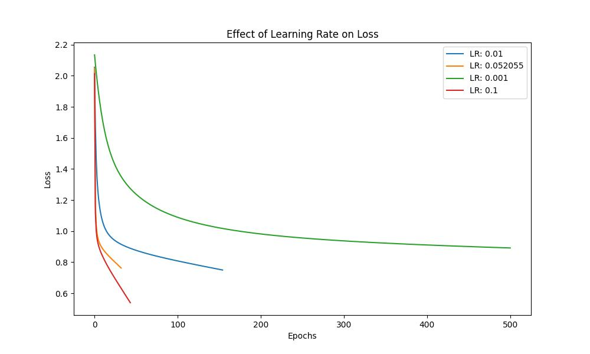
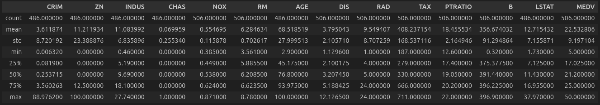
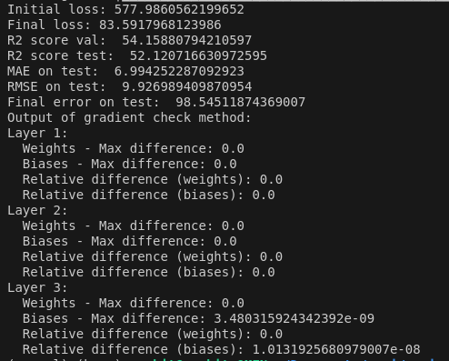

# Assignment 3 Report - Samkit Jain

## 2. Multi Layer Perceptron Classification

### 2.1 Dataset Analysis

1. The dataset described with its mean, std, min and max values is as shown below:

2. The plot below shows the distribution of the data points in the 'Quality' labels:

3. The dataset was normalised using z-score normalization and the dataset contained 0 nan values.

### 2.2 MLP from scratch

The required class is implemented in models/MLP/mlp.py with the required activation functions and with the appropriate fit and predict methods. The different optimization methods along with the gradient_check method have been included as well.

### 2.3 Model Training and Hyperparameter Tuning

The output obtained with the hidden layer of sizes [32,16] with activation function as relu and learning rate of 0.01 and mini-batch optimizer is:

Since the number of occurences of the labels [3,4,8] are very small, we observe that the precision and recall values for these is very small to almost negligible. This is results in a lower overall F1-score but the actual performance of the model is not too bad.

The output of the gradient_check function for this classification for the above architecture is:

It is observed that the relative difference is of the order of $10^{-7}$ or smaller and hence the check is successful.

The hyperparamter tuning was done using wandb while logging all the required metrics. The following is the link to the results of the sweep ran on the classifier:

https://wandb.ai/samkit_25j_/Classifier_hyperparametrs

The best model obtained from this has the following parameters:
- Hidden layers : [64,32]
- Activation function: tanh
- Batch size: 32
- Epochs: 1000
- Learning Rate: 0.052055
- Optimizer: mini-batch

### 2.4 Evaluating best single-label classification model

The best classifier model as mentioned above gives the following results:

### 2.5 Analyzing Hyperparameters Effects

1. Effect of Non-Linearity:

We can observe that the linear activation function reaches its minimum value in very few iterations because of the fact that the model then essentially acts as a linear regression model since each layer can be written as a linear combinations of the rest. Therefore, using relu tanh and sigmoid adds non linearity to the model and helps in better learning.

Here, tanh performs the best.

2. Effect of learning rate:

We see a steep decent for 0.1 because this causes the fastest descent along the gradient but can also cause divergence due to not being small enough to converge to the optimal minima.

3. Effect of batch size:

Smaller batch sizes help improving speed and generalising the model. Whereas larger batches are slower but provide a more stable and precise gradient.

### 2.6 Multi-Label Classification

1. The MLP class for multi-label classification is implemented in models/MLP/mlp.py and also in mlp_ml.py which is specifically for multi-label classification.

2. All the required methods of the class have been implemented, including fit, predict and gradient_check methods. The hamming loss, accuracy, recall, precision and F1-score have been calculated as well.

The results of architecture [20,20] as the hidden layers with relu activation function, learning rate of 0.01 and mini-batch optimizer are:

The results of the gradient check method for the above model is:

I also ran a sweep on all the parameters and obtained the following as the best model:

https://wandb.ai/samkit_25j_/Multi-Label_hyperparametrs

- Hidden layers : [64,32]
- Activation function: sigmoid
- Batch size: 32
- Epochs: 1000
- Learning Rate: 0.028139
- Optimizer: sgd

### 2.7 Analysis

The confusion matrix for the model is:

It can be observed that the model was not able to classify the label `books` very well and misclassified the label a lot. The same is true for electronics. The model performed relatively better on labels like clothing and sports.

## 3 MLP Regression

### 3.1 Data Preprocessing

1. Description of the dataset is below:

The meaning of each of the columns of the data set is as shown below:

- ZN: proportion of residential land zoned for lots over 25,000 sq.ft.
- INDUS: proportion of non-retail business acres per town
- CHAS: Charles River dummy variable (= 1 if tract bounds river; 0 otherwise)
- NOX: nitric oxides concentration (parts per 10 million)
- RM: average number of rooms per dwelling
- AGE: proportion of owner-occupied units built prior to 1940
- DIS: weighted distances to five Boston employment centers
- RAD: index of accessibility to radial highways
- TAX: full-value property-tax rate per $10,000
- PTRATIO: pupil-teacher ratio by town 12. 
- B: 1000(Bk−0.63)2 where Bk is the proportion of blacks by town 13. 
- LSTAT: % lower status of the population
- MEDV: Median value of owner-occupied homes in $1000s

2. The distribution of the data in the various attributes is as shown below:

3. The data is split into train, val and test sets using the `split_dataset()` function.

4. There are a total of `112` nan values in the dataset and they were replaced with the mean of each of the corresponding columns. The data was also normalised using the z-score method.

### 3.2 MLP Regression from scratch

All of the requirements of the MLP Regression model are met in `models/MLP/mlp.py`. All optimizers along with activation functions have been imlpemented. The fit and predict methods and the method for gradient_check has been written as well.

### 3.3 Model Training and Hyperparameter Tuning

The following are the results for a model of size `[16,32,8,4]` with activation function as relu, mini-batch with batch size of 32 and 1000 epochs.The results are as shown below:

The results of the gradient_check method are:

The hyperparamter tuning was done using wandb while logging all the required metrics. The following is the link to the results of the sweep ran on the classifier:

https://wandb.ai/samkit_25j_/Regressor_hyperparametrs

The best model obtained from this has the following parameters:
- Hidden layers : [32,16]
- Activation function: relu
- Batch size: 256
- Epochs: 100
- Learning Rate: 0.066466
- Optimizer: mini-batch

### 3.4 Evaluating Model

The results of the above best model are shown below:

### 3.5 MSE vs BCE

The diabetes dataset can be described with the following parameters:

The loss vs epochs plots for both bce and mse are as follows:

Observations:
- The BCE loss decreases steadily and seems to have a smoother curve compared to the MSE plot. It has an exponential decay pattern, indicating that the loss is reducing faster at the beginning and slows down as it approaches the lower bound.
- BCE appears to converge faster at the beginning whereas MSE has a gradual convergence

### 3.6 Analysis

The MSE is fairly consistently low with few spikes based on the testY value. Especially, when the
true y value is 1, the MSE has spikes implying that these points are being treated as outliers. 

### 3.7 Bonus

The MLP class in `models/MLP/mlp.py` can perform both types of classifications, i.e., multi-class and multi-label classifications along with MLP regression. 
The common parts of all of these is the way we fit data into the model and also the back propogation steps are quite similar in the sense that except for the output layers of the models the gradients for the hidden layers are found in a similar fashion.

## 4 AutoEncoders

### 4.1 Autoencoders from scratch

The best dimensions obtained from the last assignment using PCA was `7`. The autoencoders class has been implemented in `models/autoencoder/autoencoder.py`. The class has the initialization of the MLP model along with a `fit` method and `get_latent` method to return the reduced dataset.

### 4.2 Training

I trained the model with the following hidden layers:
-  Encoder: The encoder takes an input of 13 dimensions and hence the architecture is `[13, 32, 16, 8, 7]`
- Decoder: The decoder uses the 7 dimensional encoded data to resconstruct the inital input and hence the architecture is `[7, 8, 16, 32, 13]`

The final obtained reconstruction error is $0.057160811167160964$

### 4.3 AutoEncoder + KNN

The results of running the `spotify1` dataset on the autoencoder, and the results obtained were as follows:

Whereas compared to PCA where the results were:

Therefore, we observe that the accuracy obtained from AutoEncoders is much higher than that of PCA. 

This is because AutoEncoders can encode the non linearities in the dataset as well when reducing the dimensions, whereas PCA uses only eigen vectors and hence can not use the non-linearities. This results in better dataset representation in lower dimensions by AutoEncoders.

### 4,4 MLP Classification

I trained an MLP classifier with parameters as:
- Hidden layers: `[32, 54, 256, 128]`
- Learning Rate: 0.01
- Optimizer: mini-batch
- Activation Function: relu
- Early stopping is True

The results of training the model and testing gives the following results:

We can see that we obtain better results with MLP which can be further enhanced by doing hyperparameter tuning.

