# Assignment 4 Report - Samkit Jain

## 2. Classification Using CNN

### 2.1 Data Loading and Preprocessing

The `load_mnist_data()` and the class to create the dataset, `MultiMNISTDataset` was also implemented that satisfies the requirements of `torch.utils.DataLoader` by having `__len__` and `__getitem__` methods in the class.

### 2.2 Implement the CNN class

The CNN class is implemented in the python notebook as well as in the `models/cnn/cnn.py`.

### 2.3 Hyperparameter Tuning

I ran the CNN with 5 configurations in the notebook and am putting the loss plots for 2 of those configurations.

CNN1:

```
conv_layers=[32,64]
kernel_size=[3,5]
dense_layers=[128,32]
```

Loss vs epochs plot:

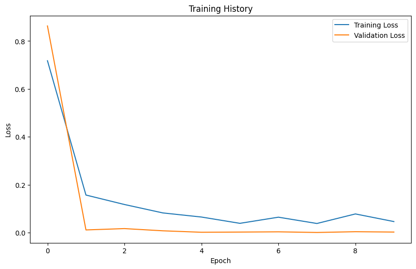

The accuracy of this model is `99.97%`

CNN2:

```
conv_layers=[32]
kernel_size=[5]
dense_layers=[32]
```

Loss vs Epochs plot:

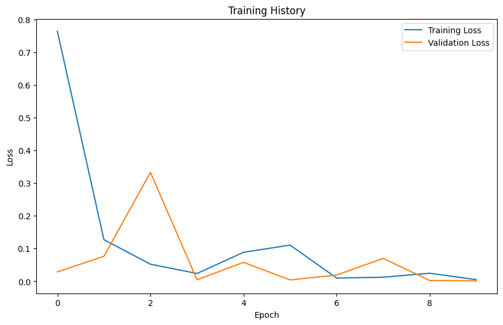

The accuracy of this model is `99.6%`

CNN1 Regression:

```
conv_layers=[32,64]
kernel_size=[3,5]
dense_layers=[128,32]
```

Loss vs Epochs plot:

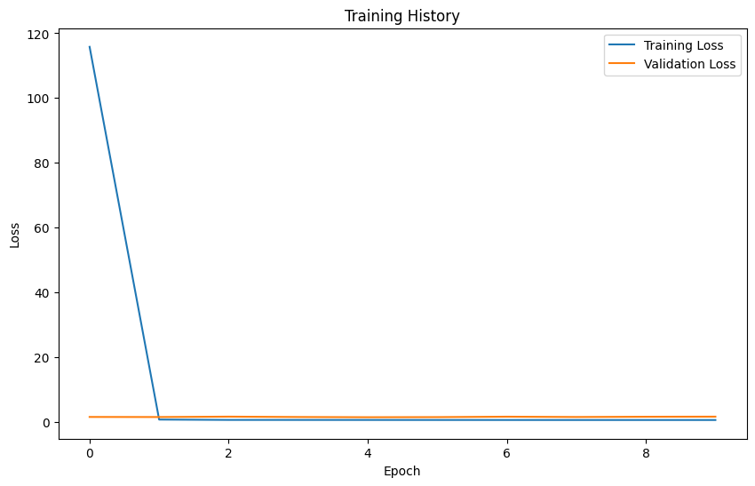

The accuracy for this model is `32.6%`

CNN2 Regression:

```
conv_layers=[32]
kernel_size=[5]
dense_layers=[32]
```

Loss vs Epochs plot:

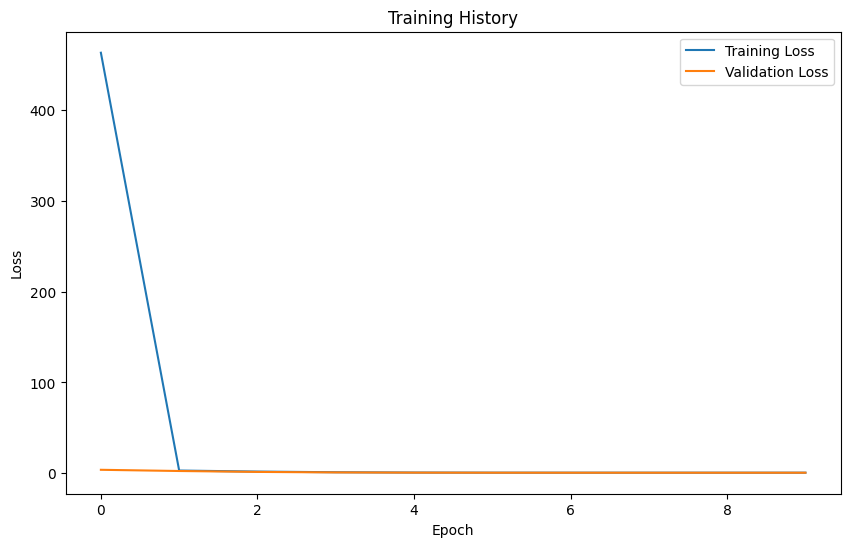

The accuracy of this model is `43.4%`

The best model is CNN1 with the configuration:

```
conv_layers=[32,64]
kernel_size=[3,5]
dense_layers=[128,32]
```

### 2.4 Feature Map visualisation

The feature maps of 3 images in the training set are as shown below for each layer of CNN1:

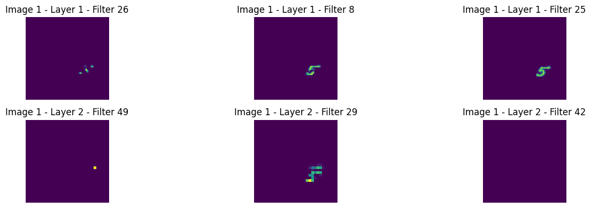

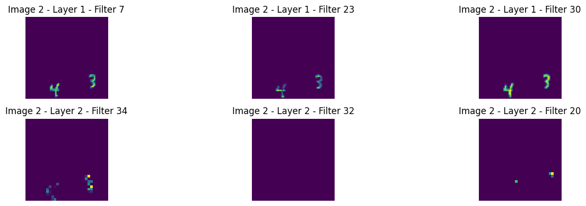

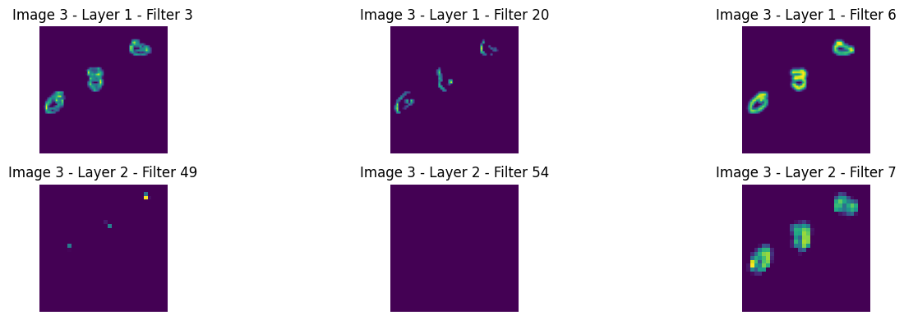

## 3. MultiLabel Classification

### 3.1 Data Loading and Preprocessing

The `load_mnist_data()` and the class to create the dataset, `MultiMNISTDataset` was also implemented that satisfies the requirements of `torch.utils.DataLoader` by having `__len__` and `__getitem__` methods in the class. The labels have been one hot encoded based on the correct labels with digits.

### 3.2 Implement the MultiLabel CNN class

The class has been implemented in the `MultiLabel_CNN` python notebook as well as in `models/cnn/multilabel_cnn.py`

### 3.3 Hyperparameter Tuning

Each image can contain up to **three digits** in sequence, requiring us to keep track of both the identity of each digit and its specific position within that sequence. To achieve this, we employ three distinct one-hot encoded segments, each representing one digit.

#### One-Hot Encoding for Digit Positions

For each of the three possible digit positions (first, second, and third), we create an **11-dimensional one-hot encoded vector**. This vector includes:
- **10 dimensions** that correspond to the digits **0 through 9**.
- An **additional dimension** designated as the "None" category, which accounts for instances where fewer than three digits are present. This distinction is crucial for differentiating between sequences like `[2, 5]` (indicating two digits) and `[2, 5, None]` (where the third digit is absent).

#### Structure of the Complete Label Vector

By concatenating the three **11-dimensional vectors**, we obtain a **33-dimensional one-hot encoded vector** (3 positions × 11 classes per position). This comprehensive vector format allows us to represent both the specific digits found in an image and their precise order within the sequence.

#### Loss Function

We utilize the `torch.nn.BCEWithLogitsLoss` function to compute the loss. According to its definition, this function applies a sigmoid layer to its output automatically, meaning we do not need to include a separate output layer in our model.

The outputs for 2 configurations are as shown below:

Config1:

```
conv_params = [
    (1, 0, 0),
    (32, 3, 1),
    (64, 3, 1),
    (128, 3, 1)
]
fc_layers = [32768, 256, 33]
activation_fn='relu'
learning_rate=0.001
optimizer:adam
```

Plot:

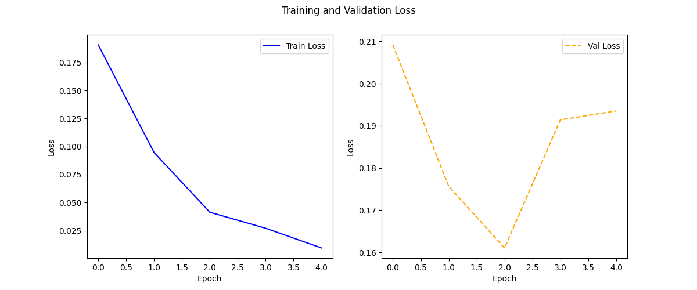

`Validation - Loss: 0.1935, Hamming Accuracy: 96.1111, Exact Match Accuracy: 29.2667`

Config2:

```
conv_params_4 = [
    (1, 0, 0),
    (64, 3, 1),
    (128, 3, 1),
    (256, 3, 1)
]
fc_layers_4 = [65536, 256, 33]
activation_fn='relu',
pooling_type='avg',
learning_rate=0.0001,
optimizer_choice="sgd"
```

Plot:

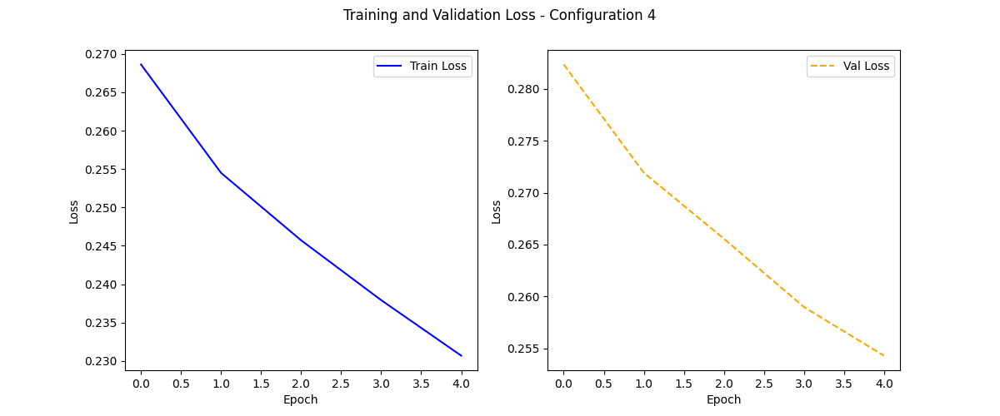

`Validation - Loss: 0.2543, Hamming Accuracy: 88.6192, Exact Match Accuracy: 0.1333`


## 4. Autoencoder

### 4.2 CNN AutoEncoder

### 4.2.1 Data Analysis and Preprocessing

Few of the images from the dataset are as shown:

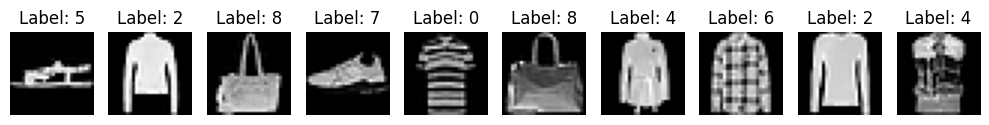

On observing the dataset images, the following can be infered about the classes:

```
0 - T-shirts
1 - Pants
2 - Sweatshirts
3 - Dress
4 - Coats
5 - Slippers
6 - Shirts
7 - Shoes
8 - Bag
9 - Boots and Heels
```

### 4.2.2 Implement CNN Autoencoder Class

The class has been implemented in the `AutoEncoder` python notebook.

### 4.2.3 Plots and Visualization

The reconstructed images of a few training images are as shown:

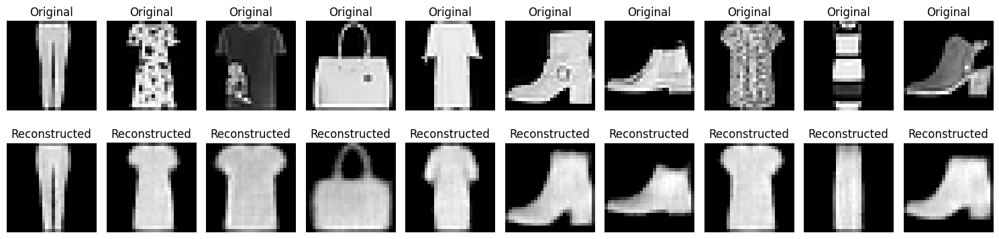

The latent space plots in 2D and 3D are as shown as below:

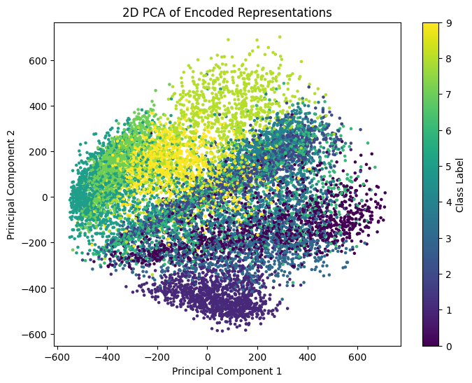

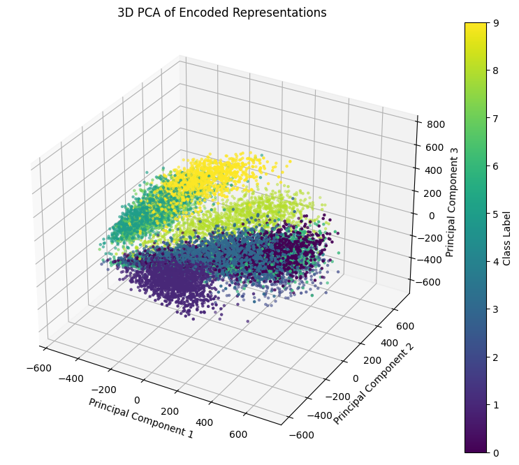

We can clearly see that the data points belonging to the same classes are visibly separated in the space and can be distinguished, which shows the good results obtained from the autoencoder.

### 4.2.4 Hyperparameter tuning

In different configurations the training loss and validation loss curves are shown below:

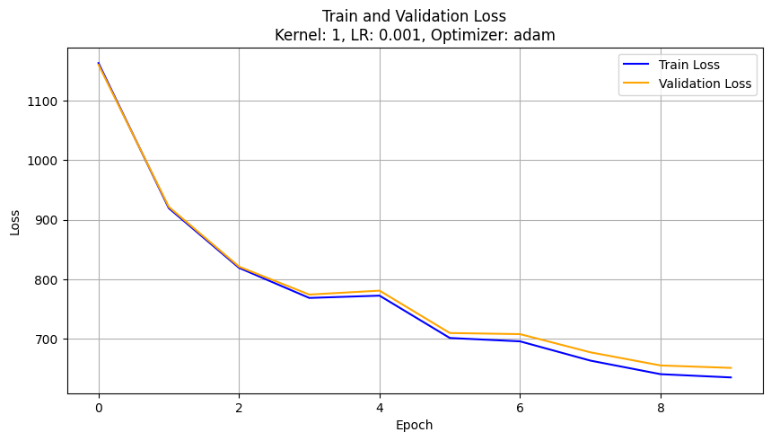

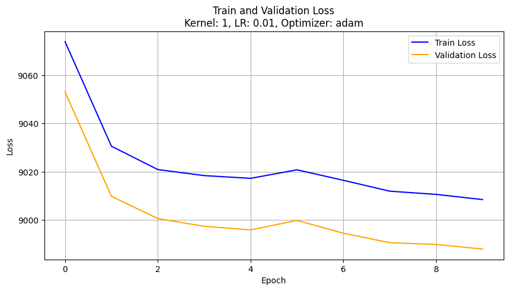

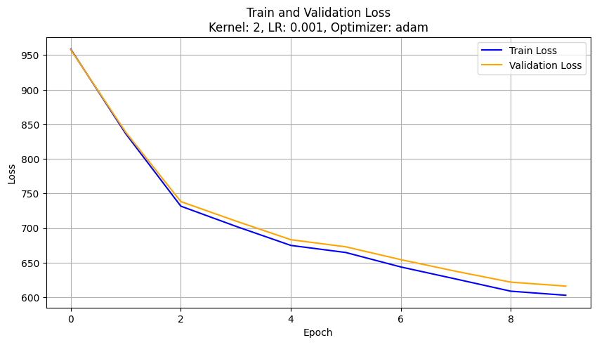

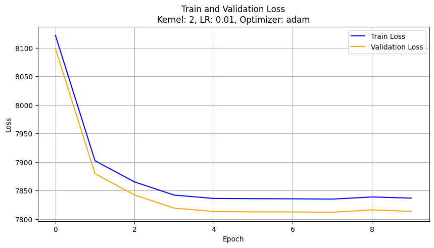

### 4.3 MLP AutoEncoder

The reconstructed images from the MLP autoencoder are as shown below:

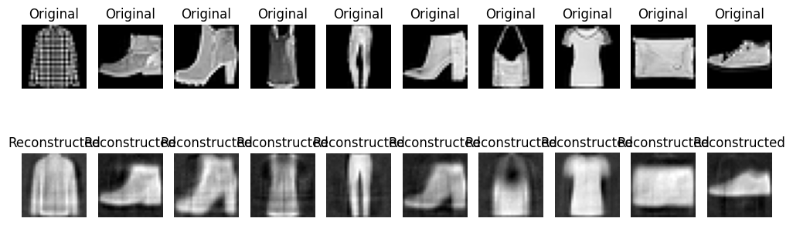

The training loss vs epochs plot for the above autoencoder is as shown below:

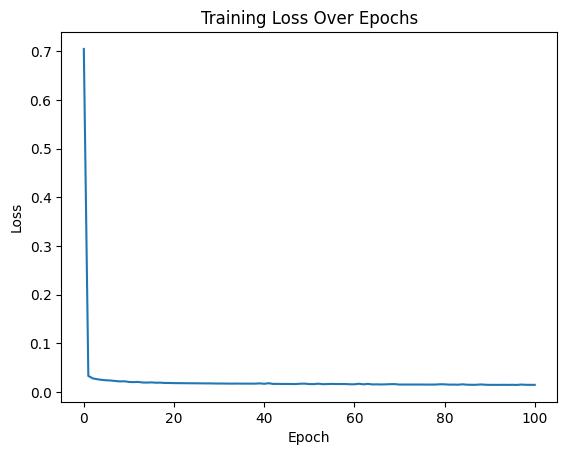


### 4.4 PCA AutoEncoder

### 4.4.1 PCA AutoEncoder class implementation

The `PCAAutoEncoder` class has been implemented in the `AutoEncoder` python notebook with the required methods.

### 4.4.2 Estimate optimal number of components

The Reconstruction loss vs number of components plot is shown below:

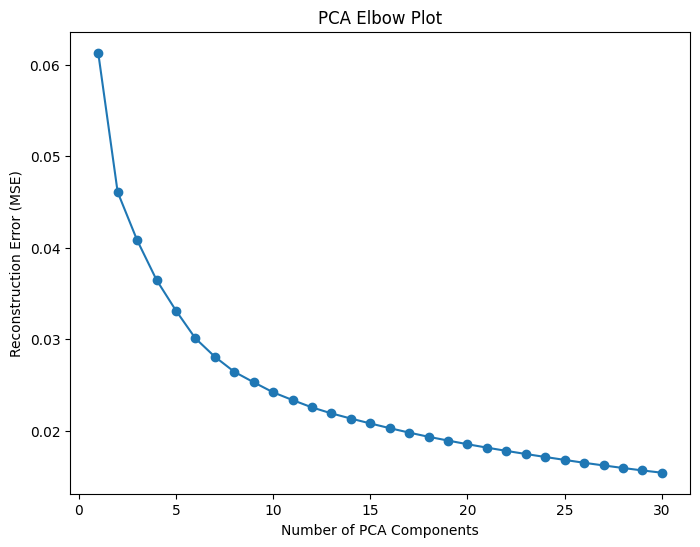

Since there is no obvious elbow point i took the value of $k_{optimal}=25$.

The reconstruction of the autoencoder with number of components as $k_{optimal}$ was as follows:

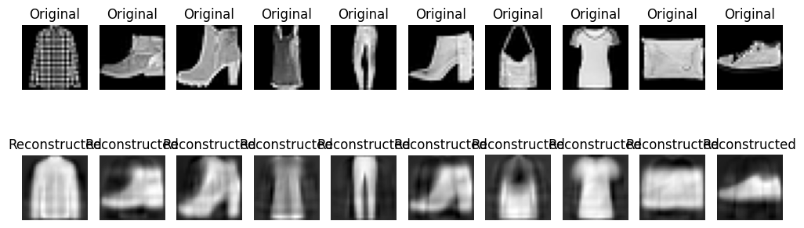

### 4.5 KNN Classification

All the three autoencoders are reduced to $k_{optimal}=25$ number of dimensions.

The accuracies of knn with the various encoded datasets are as shown below:

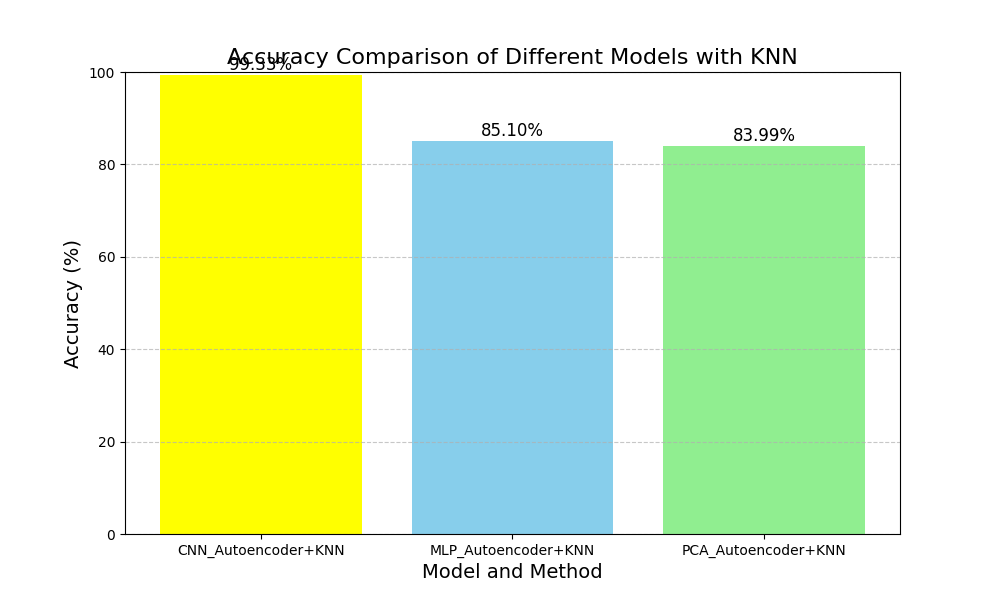
