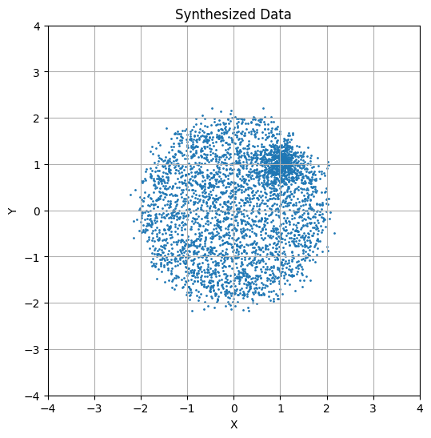
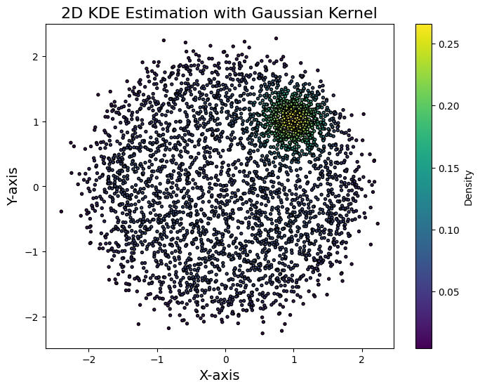
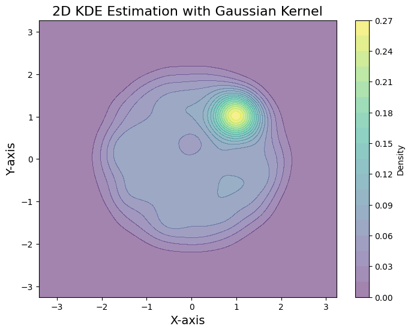
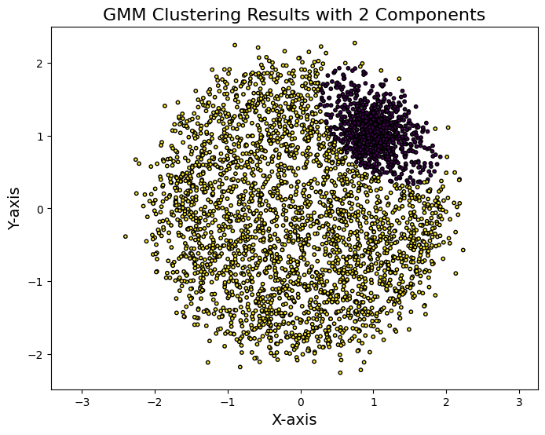
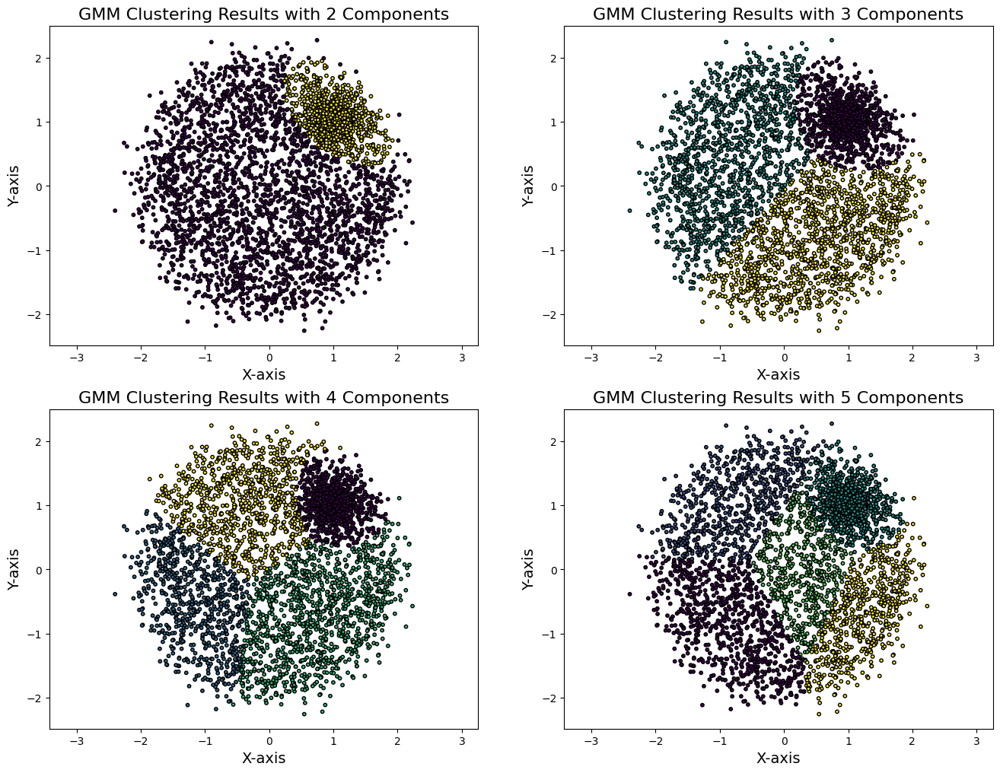
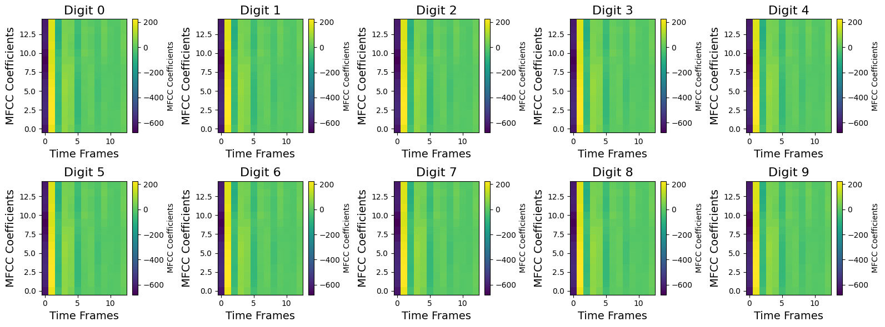
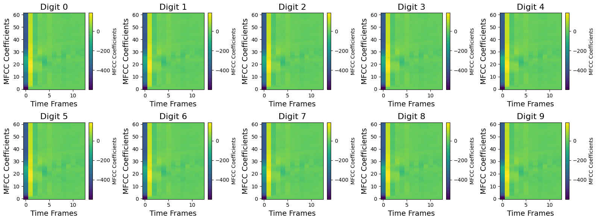
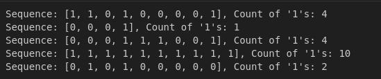
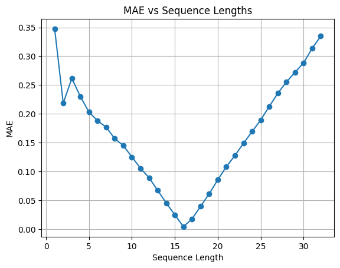
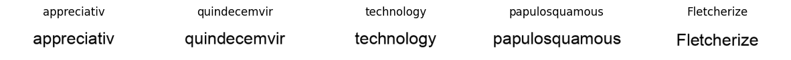

# ASSIGNMENT 5 Report - Samkit Jain

## 2. KDE

### 2.1 KDE Class

The KDE has been created in `models/kde/KDE.py` along with the required fit, predict and visualization methods.

### 2.2 Synthetic Data

The synthetic data was genrated by uniformly sampling points from within a circle of radius 2 and the dense area was genrated by sampling within a circle of radius 0.3 units. After the points are genrated, normal gaussian noise was added all points to simulate variance.



### 2.3 KDE vs GMM

Running KDE on the above dataset gives the following results:





When GMM is run with `n_components = 2` the following results are observed:



Running for multiple values of `n_components` we observe:



KDE is a non-parametric method, which means it doesn’t assume a specific form for the distribution whereas GMM assumes that the data was generated using a mixture of Gaussian distributions. 

KDE fits the data consistently when the bandwidth is appropriately tuned. On the other hand GMM’s performance depends on the number of components 
n_components. Too few components lead to underfitting, while too many may overfit the data.

## 3. HMMs

### 3.1 & 3.2 Speech Digit Recognition and Dataset

Using the librosa library, the MFCC of the `.wav` files was extracted and the heatmap visualization of the MFCC for the digits is as shown below:



The MFCC heatmaps reveal clear temporal patterns in spoken digits that make HMMs ideal for classification. Each digit shows distinct phases that progress over time. These states transition gradually, and there are subtle variations within each state - exactly what HMMs are designed to model through their state transition and emission probabilities.

### 3.3 Model Architecture

The hmmlearn library was used to train models for each digit on their corresponding MFCC's and extract the digit from the model that gives the best results(highest probability). 

### 3.4 Metrics

- The trained model gives an accuracy of about `90.83%` accuracy on the test dataset.

- The MFCC's for the digits recorded in my voice are shown below:

    

    The model trained earlier gives an accuracy of `36.67%` on this dataset. We observe this is much lower than earlier which could be due to the quality of the data, for example, the data in my voice has not been trimmed which could be resulting in quite a bit of drop in accuracy. 

## 4. RNNs

### 4.1 Counting Bits

### 4.1.1 Dataset

The dataset is created by randomly picking sequence lengths and then genrating a random series of 0's and 1's. These sequences are then padded to the max_length of the sequences.

A few example sequences are as shown below:



### 4.1.2 Architecture

The model `RNNModel` contains the architecture of model. It uses inbuilt torch rnn layers with hidden_size of 64.

### 4.1.3 Training

The training loop is implemented with the `RNNModel` class itself.

### 4.1.4 Generalization

Sequences from lengths 1 to 32 were generated and the inferences from the model were run on the these sequences. The MAE vs sequence length was plotted and below are the results.



The following results are expected since for shorter sequences there isnt enough history and for longer sequences, the history for such long sequences are not available after a few rnn layers and hence do not carry forward correctly.

Although, I think it makes more sense to run the model by changing the batch size to 1 without any padding to the sequences. I think the MAE should be very less for shorter sequences too since there isnt much history to be passed through the rnn layers anyway. I am unable to test this due to the lack of time.

### 4.2 Optical Character Recognition

### 4.2.1 Dataset

The dataset is generated using the `nltk.corpus.words` and they are then written onto blank white images using `Pillow.Images`.

A few examples of these images with there labels are shown below:



### 4.2.2 Architecture

The architecture includes a CNN encoder that extracts the key features from the images followed by a fully connected layer to transition to the RNN layer. The RNN essentially acts as a decoder by decoding characters in a sequence.

### 4.2.3 Training

The training loop is included within the class `CRNN`.

The results for three configurations are shown below. The configs can be viewed in the `crnn.ipynb` python notebook.

1. CRNN1

```
Prediction 1: suodaaaly
True Labels 1: subduably
----------------------------------------
Prediction 2: disssssiiee
True Labels 2: discussible
----------------------------------------
Prediction 3: voedll
True Labels 3: vocably
----------------------------------------
Prediction 4: pyametoo
True Labels 4: phymatoid
----------------------------------------
Prediction 5: pestennnal
True Labels 5: pentagonal
----------------------------------------
Validation Accuracy: 52.95%
Random Baseline Accuracy: 1.85%
Epoch 1/3: Train Loss: 1.1246, Validate Loss: 0.6877
Prediction 1: subduably
True Labels 1: subduably
----------------------------------------
Prediction 2: diccuusible
True Labels 2: discussible
----------------------------------------
Prediction 3: vocably
True Labels 3: vocably
----------------------------------------
Prediction 4: phymatood
True Labels 4: phymatoid
----------------------------------------
Prediction 5: pentagonal
True Labels 5: pentagonal
----------------------------------------
Validation Accuracy: 80.88%
Random Baseline Accuracy: 1.90%
Epoch 2/3: Train Loss: 0.4688, Validate Loss: 0.2926
Prediction 1: subbuaaly
True Labels 1: subduably
----------------------------------------
Prediction 2: discussiile
True Labels 2: discussible
----------------------------------------
Prediction 3: vocably
True Labels 3: vocably
----------------------------------------
Prediction 4: phymatood
True Labels 4: phymatoid
----------------------------------------
Prediction 5: pentagonal
True Labels 5: pentagonal
----------------------------------------
Validation Accuracy: 88.89%
Random Baseline Accuracy: 1.95%
Epoch 3/3: Train Loss: 0.2418, Validate Loss: 0.1749
```

2. CRNN2

```
Prediction 1: subbaaaly
True Labels 1: subduably
----------------------------------------
Prediction 2: dinnsssill
True Labels 2: discussible
----------------------------------------
Prediction 3: vocabyy
True Labels 3: vocably
----------------------------------------
Prediction 4: phgmatiin
True Labels 4: phymatoid
----------------------------------------
Prediction 5: pestrggaal
True Labels 5: pentagonal
----------------------------------------
Validation Accuracy: 51.95%
Random Baseline Accuracy: 1.90%
Epoch 1/3: Train Loss: 1.1186, Validate Loss: 0.6856
Prediction 1: subduably
True Labels 1: subduably
----------------------------------------
Prediction 2: discussiile
True Labels 2: discussible
----------------------------------------
Prediction 3: vocalyy
True Labels 3: vocably
----------------------------------------
Prediction 4: phymatiid
True Labels 4: phymatoid
----------------------------------------
Prediction 5: pentagoncl
True Labels 5: pentagonal
----------------------------------------
Validation Accuracy: 83.53%
Random Baseline Accuracy: 1.93%
Epoch 2/3: Train Loss: 0.4766, Validate Loss: 0.2536
Prediction 1: subduably
True Labels 1: subduably
----------------------------------------
Prediction 2: discussible
True Labels 2: discussible
----------------------------------------
Prediction 3: vocably
True Labels 3: vocably
----------------------------------------
Prediction 4: phymatooid
True Labels 4: phymatoid
----------------------------------------
Prediction 5: pentagonal
True Labels 5: pentagonal
----------------------------------------
Validation Accuracy: 90.21%
Random Baseline Accuracy: 1.92%
Epoch 3/3: Train Loss: 0.2468, Validate Loss: 0.1524
```

3. CRNN3

```
Prediction 1: subwdaally
True Labels 1: subduably
----------------------------------------
Prediction 2: disccssslle
True Labels 2: discussible
----------------------------------------
Prediction 3: oocably
True Labels 3: vocably
----------------------------------------
Prediction 4: phymntiio
True Labels 4: phymatoid
----------------------------------------
Prediction 5: pentaoooal
True Labels 5: pentagonal
----------------------------------------
Validation Accuracy: 56.44%
Random Baseline Accuracy: 1.81%
Epoch 1/3: Train Loss: 1.0985, Validate Loss: 0.6530
Prediction 1: subuuably
True Labels 1: subduably
----------------------------------------
Prediction 2: discussible
True Labels 2: discussible
----------------------------------------
Prediction 3: vocably
True Labels 3: vocably
----------------------------------------
Prediction 4: phymatood
True Labels 4: phymatoid
----------------------------------------
Prediction 5: pentagonal
True Labels 5: pentagonal
----------------------------------------
Validation Accuracy: 84.54%
Random Baseline Accuracy: 1.83%
Epoch 2/3: Train Loss: 0.4579, Validate Loss: 0.2276
Prediction 1: subduably
True Labels 1: subduably
----------------------------------------
Prediction 2: disoussible
True Labels 2: discussible
----------------------------------------
Prediction 3: vocably
True Labels 3: vocably
----------------------------------------
Prediction 4: phymatoid
True Labels 4: phymatoid
----------------------------------------
Prediction 5: pentagnnal
True Labels 5: pentagonal
----------------------------------------
Validation Accuracy: 90.78%
Random Baseline Accuracy: 1.89%
Epoch 3/3: Train Loss: 0.2471, Validate Loss: 0.1379
```


